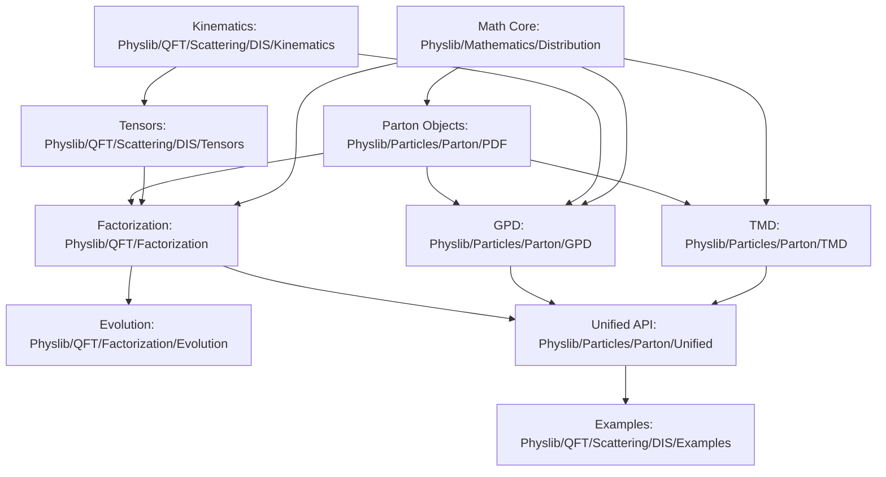

# DIS Import Graph Proposal (Stage 0)

## 1. Goal

Define a stable import structure that enables parallel development and avoids cyclic dependencies.

## 2. Proposed Module Tree

## 3. Allowed Dependency Rules

- `Mathematics/*` cannot import physics domain modules
- `Kinematics` can be imported by tensor and GPD kinematics modules
- `Parton/PDF` should not import QFT factorization modules
- `Factorization` can depend on `Kinematics`, `Tensors`, and `PDF`
- `Unified` can depend on all stabilized lower-level interfaces but must not introduce new core definitions

## 4. Anti-Patterns to Avoid

- Defining convolution primitives in physics-facing modules
- Duplicating scalar invariant definitions in multiple namespaces
- Hiding key assumptions in local helper lemmas without API-level exposure
- Back-importing from examples into core modules

## 5. Parallelization Boundaries

Parallel lane boundaries inferred from import graph:

- Lane A: `Kinematics` and low-level `Mathematics` utilities
- Lane B: `PDF` object and assumptions
- Lane C: `Tensors` once `Kinematics` API is stable
- Lane D: `Factorization` once `Tensors` and `PDF` are stable
- Lane E: `TMD` and `GPD` after `PDF` API stabilization

## 6. Stage 0 Freeze Statement

This graph is frozen for Stage 1 planning. Proposed changes require:

- A rationale linked to a blocked theorem or cycle elimination
- Explicit migration plan
- Owner approval from both source and target module lanes
